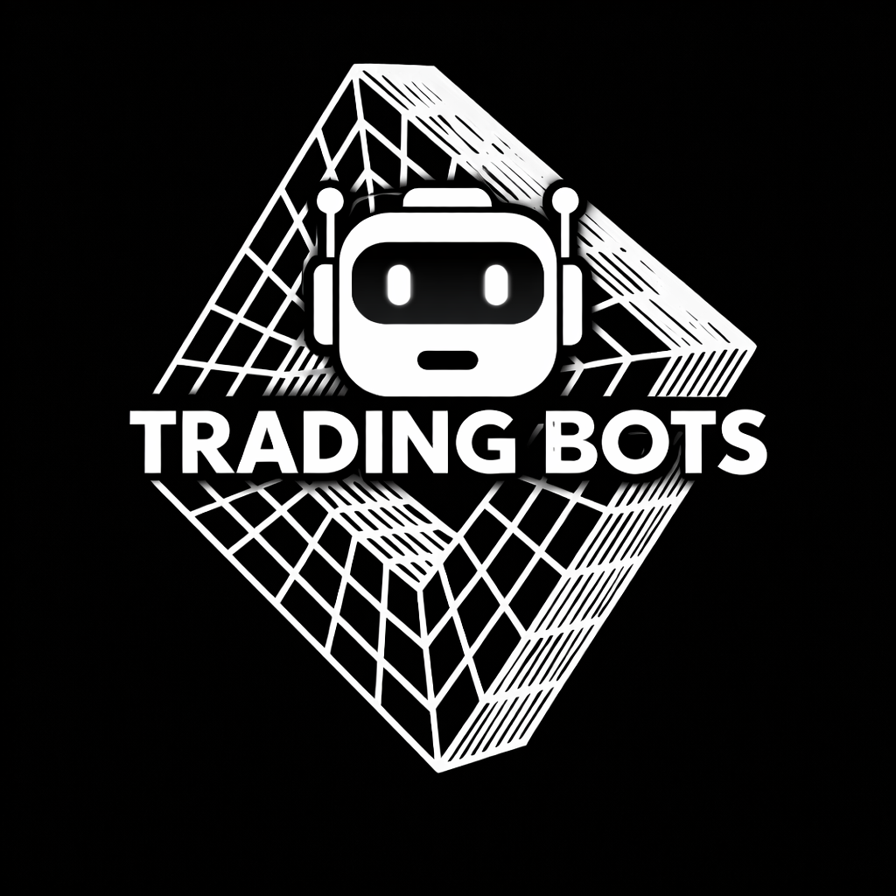
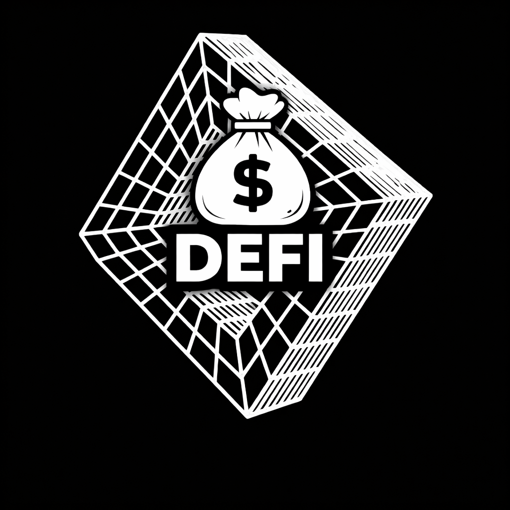
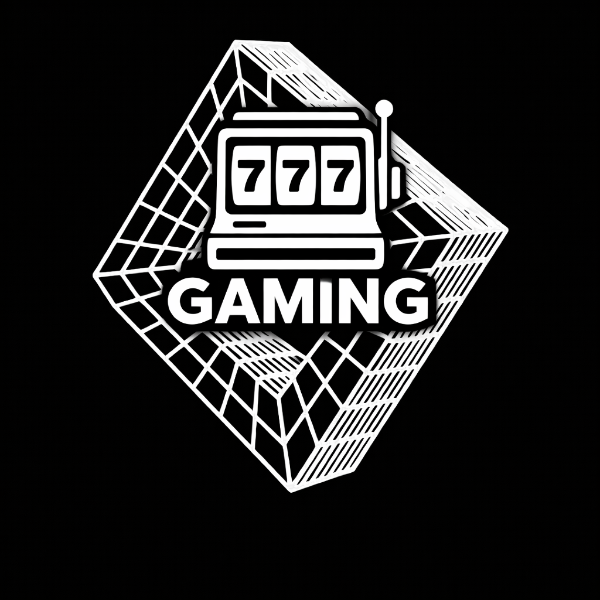
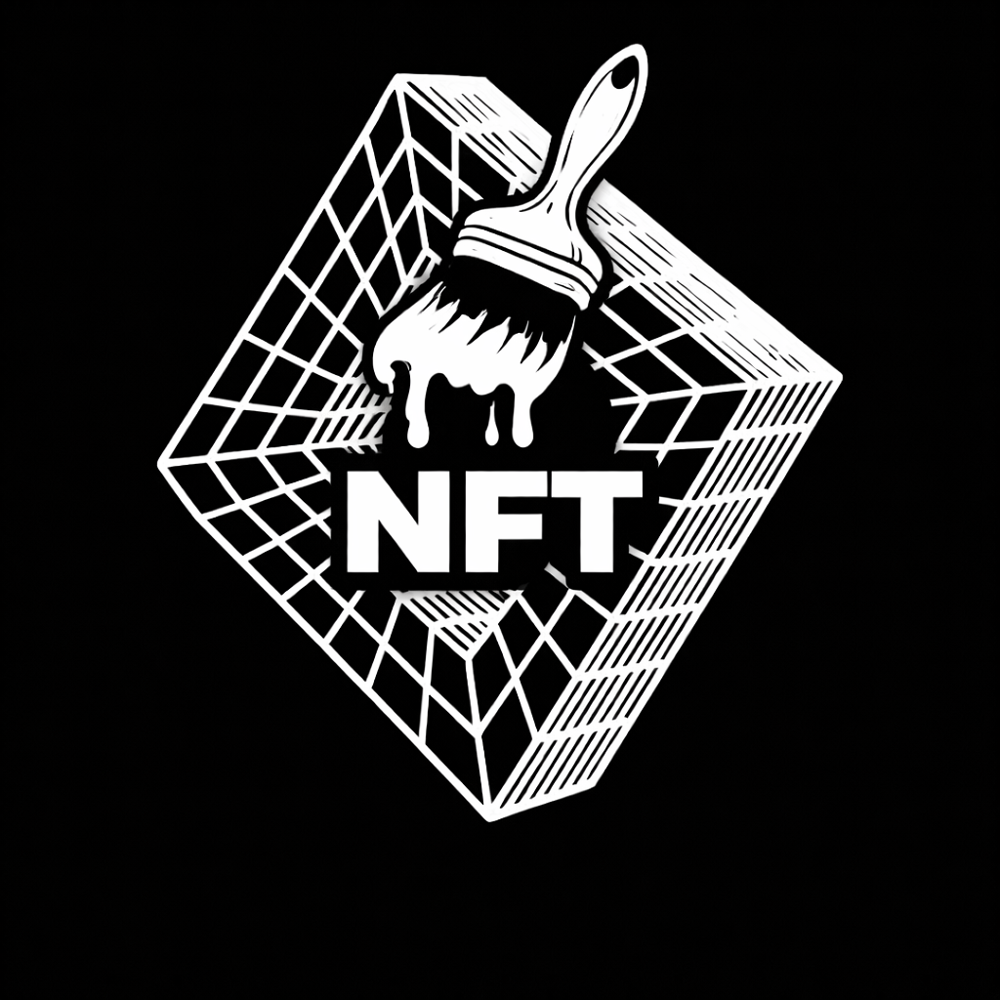

# 🔷 GRID XRPL - Project Portfolio

  
  
  
  **A showcase of our Web3 development capabilities and products**
  
  
  

---

## 📚 Project Categories

| Category | Count | Description |
|----------|-------|-------------|
| [ Trading Bots](projects/trading-bots.md) | 3 | Snipers, volume tools, market makers |
| [ DeFi Tools](projects/defi-tools.md) | 5 | Wallets, airdrops, locking, DEX tools |
| [ Gaming Platforms](projects/gaming-casino.md) | 4 | Blockchain games, entertainment platforms |
| [ NFT](projects/nft.md) | 1 | NFT marketplaces and tools |
| [🌐 Websites & Platforms](projects/websites.md) | 6 | Web applications and platforms |
| [🛠️ Utilities](projects/utilities.md) | 3 | Token tools, nodes, ticketing |

**Total Projects: 22**

---

## 🌟 Highlights

### Most Popular
- 🥇 **XRPL Wallet** - Secure, user-friendly wallet
- 🥈 **NFT Marketplace** - Full-featured NFT trading
- 🥉 **Community Platform** - Engagement hub

### Most Powerful
- ⚡ **Sniper Bot** - Lightning-fast token sniping
- ⚡ **Market Maker Pro** - Token-optimized market making
- ⚡ **Volume Bot** - Intelligent volume generation

### Most Innovative
- 💡 **Auto Airdrop** - Fully automated distribution
- 💡 **Strategy Game** - Blockchain gaming
- 💡 **Token Lock** - Secure token locking

---

## 🔷 Quick Links

### By Category

<b>🤖 Trading Bots</b>

- [Market Maker Pro](projects/trading-bots.md#market-maker-pro) - Token-optimized market maker
- [Sniper Bot](projects/trading-bots.md#sniper-bot) - Token launch sniper
- [Volume Bot](projects/trading-bots.md#volume-bot) - Volume generation tool

<b>💰 DeFi Tools</b>

- [XRPL Wallet](projects/defi-tools.md#xrpl-wallet) - Secure wallet
- [Token Drop](projects/defi-tools.md#token-drop) - Token distribution
- [Auto Airdrop](projects/defi-tools.md#auto-airdrop) - Automated airdrops
- [Token Lock](projects/defi-tools.md#token-lock) - Token locking
- [Limit Order Tool](projects/defi-tools.md#limit-order-tool) - DEX limit orders

<b>🎰 Gaming Platforms</b>

- [Faucet System](projects/gaming-casino.md#faucet-system) - Token faucet
- [Card Games](projects/gaming-casino.md#card-games) - Blockchain card games
- [Strategy Game](projects/gaming-casino.md#strategy-game) - Competitive strategy
- [Entertainment Platform](projects/gaming-casino.md#entertainment-platform) - Gaming hub

<b>🖼️ NFT</b>

- [NFT Marketplace](projects/nft.md#nft-marketplace) - XRPL NFT trading

<b>🌐 Websites & Platforms</b>

- [Community Platform](projects/websites.md#community-platform) - Member hub
- [Token Website](projects/websites.md#token-website) - Project landing page
- [Streaming Platform](projects/websites.md#streaming-platform) - Media streaming
- [Multi-Brand Platform](projects/websites.md#multi-brand-platform) - Multi-site system
- [Community Hub](projects/websites.md#community-hub) - Engagement platform
- [Web3 Application](projects/websites.md#web3-application) - Utility app

<b>🛠️ Utilities</b>

- [XRPL Node](projects/utilities.md#xrpl-node) - Node infrastructure
- [Token Checker](projects/utilities.md#token-checker) - Token verification
- [Ticketing System](projects/utilities.md#ticketing-system) - Event tickets

---

## 💼 What We Build

### Expertise Areas

| Area | Technologies |
|------|--------------|
| **Blockchain** | XRPL, xrpl.js, Smart Contracts |
| **Frontend** | React, Next.js, TypeScript, TailwindCSS |
| **Backend** | Node.js, Python, Express, MongoDB |
| **Trading** | Market Making, Bot Development, DEX Integration |
| **Gaming** | Provably Fair Systems, Real-time Multiplayer |
| **NFT** | Minting, Marketplaces, Metadata |

---

## 📞 Contact

Interested in working together or licensing a project?

- **Twitter/X:** [@GridXRPL](https://x.com/GridXRPL)

---

  
  **Built with 💜 for the XRPL Community**
  

