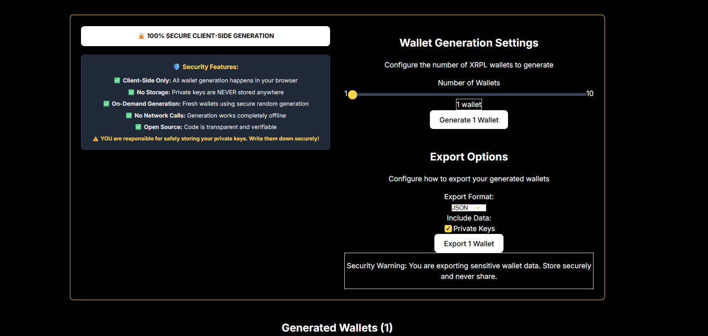
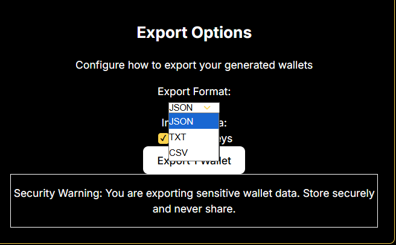

# 💰 DeFi Tools

> Decentralized Finance solutions for the XRP Ledger

---

## XRPL Wallet

  
  
  
  **Secure XRPL Wallet Generator**
  

### Overview
A sleek, single-page web application for generating XRPL wallets with professional export options. 100% client-side generation ensures maximum security - all wallet creation happens locally in your browser with no server communication.

### Features
- ✅ Generate 1-10 wallets simultaneously
- ✅ 100% client-side generation (browser-based)
- ✅ Multiple export formats (JSON, TXT, CSV)
- ✅ AES-256 encryption for exported files
- ✅ No data storage or network calls
- ✅ Real-time progress tracking
- ✅ Professional UI with gold/black theme
- ✅ Copy to clipboard functionality

### Screenshots

View Screenshots

*Generated wallets with export options*

*Multiple export formats with encryption*

### Tech Stack
`React` `TypeScript` `Vite` `TailwindCSS` `xrpl.js` `crypto-js` `Firebase Hosting`

**Live Demo:** [https://grid-wallet-generator.web.app](https://grid-wallet-generator.web.app)

---

## Token Drop

  
  
  
  **XRPL Airdrop Tool - Bulk Token Distribution**
  

### Overview
Web-based application for efficient bulk distribution of tokens on the XRP Ledger. Streamlines the process of sending tokens to multiple recipients simultaneously, perfect for airdrops, rewards distribution, and mass payment scenarios.

### Features
- ✅ Bulk token distribution to hundreds/thousands of recipients
- ✅ Multiple distribution methods (equal, proportional, custom)
- ✅ Xaman wallet integration (no private keys stored)
- ✅ Sequential payment processing with automatic tickets
- ✅ CSV/TXT file upload or manual entry
- ✅ Real-time progress monitoring
- ✅ Built-in retry mechanisms
- ✅ Comprehensive distribution reports

### Tech Stack
`Python` `Flask` `xrpl-py` `JavaScript` `Firebase` `Xaman API`

---

## Auto Airdrop

  
  
  
  **Fully Automated Airdrop System**
  

### Overview
Set-and-forget airdrop automation. Configure rules once and let the system handle distributions automatically based on triggers.

### Features
- ✅ Scheduled airdrops
- ✅ Holder snapshots
- ✅ Rule-based distribution
- ✅ Minimum balance requirements
- ✅ Exclusion lists
- ✅ Multi-token support
- ✅ Notification system

### Screenshots

View Screenshots

### Tech Stack
`TypeScript` `Node.js` `xrpl.js` `MongoDB` `Cron`

---

## Token Lock

  
  
  
  **Token Locking Mechanism**
  

### Overview
Secure token locking for vesting schedules, liquidity locks, and team allocations. Trustless and transparent.

### Features
- ✅ Time-based locks
- ✅ Linear/cliff vesting
- ✅ Multi-beneficiary support
- ✅ Emergency unlock (optional)
- ✅ Lock certificates
- ✅ Public verification
- ✅ Notification on unlock

### Screenshots

View Screenshots

### Tech Stack
`TypeScript` `xrpl.js` `React` `Node.js`

---

## Limit Order Tool

  
  
  
  **DEX Limit Order System**
  

### Overview
Place and manage limit orders on the XRPL DEX. Set your price and let the system execute when conditions are met.

### Features
- ✅ Limit buy/sell orders
- ✅ Order management dashboard
- ✅ Price alerts
- ✅ Order history
- ✅ Multi-pair support
- ✅ Order expiration settings
- ✅ Partial fill tracking

### Screenshots

View Screenshots

### Tech Stack
`React` `TypeScript` `xrpl.js` `Node.js` `MongoDB`

---

  
  [← Back to Portfolio](../README.md)
  
  **Interested in our DeFi tools?** [Contact Us](https://x.com/GridXRPL)
  

