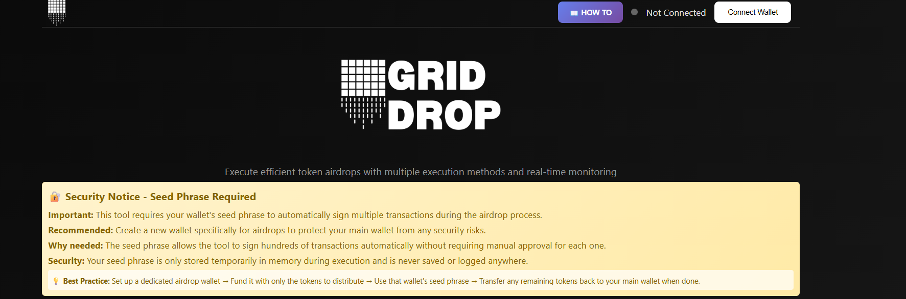
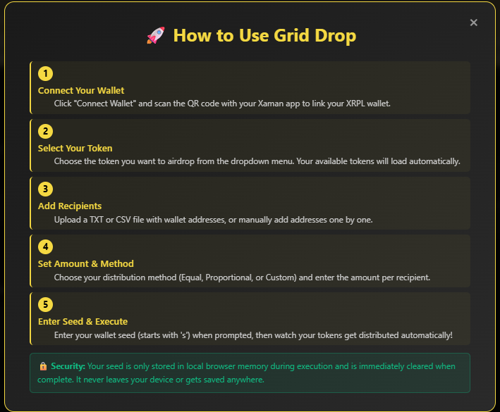
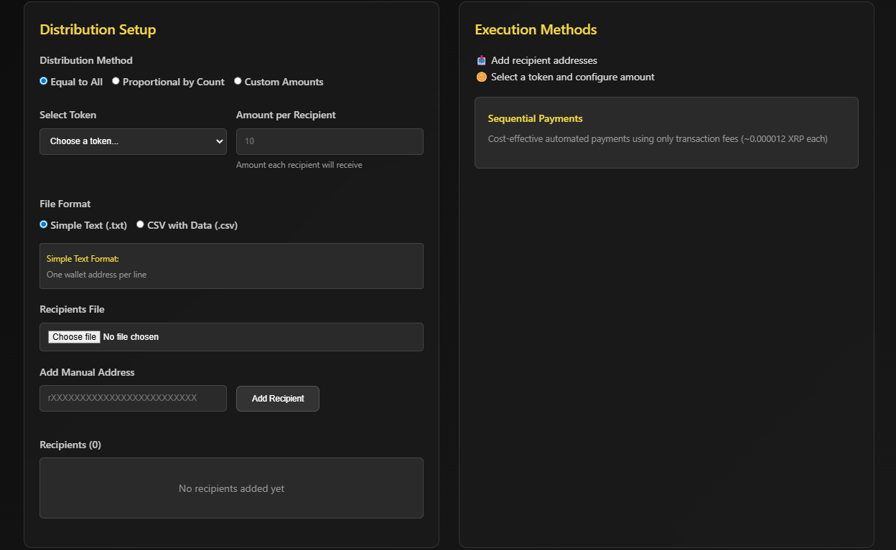
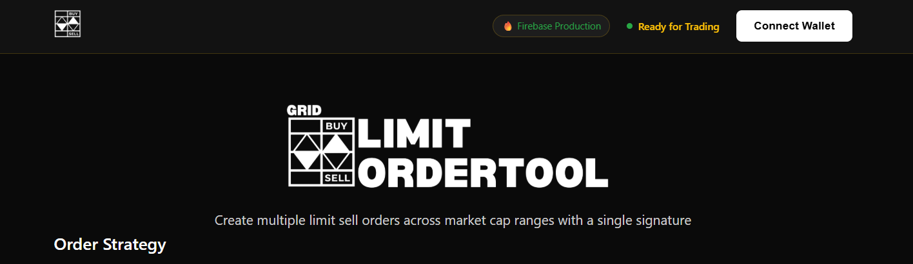
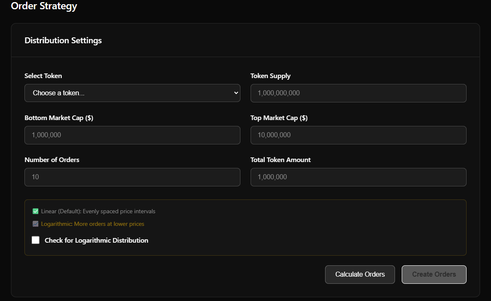
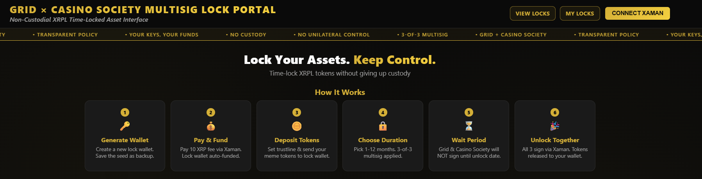
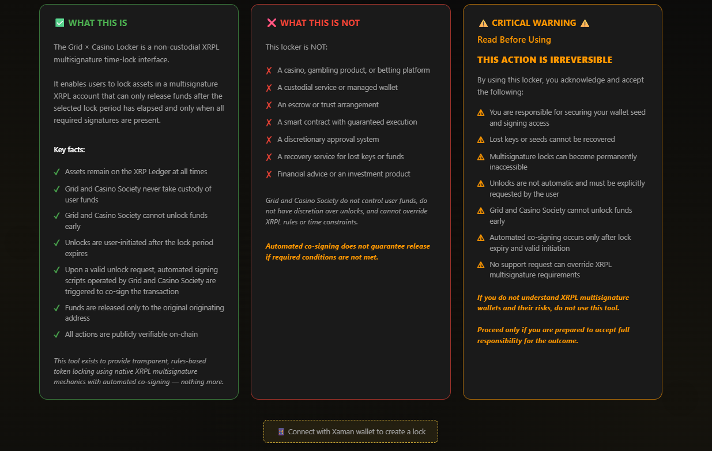

# 💰 DeFi Tools

> Decentralized Finance solutions for the XRP Ledger

---

## XRPL Wallet

  
  
  
  **Secure XRPL Wallet Generator**
  

### Overview
A sleek, single-page web application for generating XRPL wallets with professional export options. 100% client-side generation ensures maximum security - all wallet creation happens locally in your browser with no server communication.

### Features
- ✅ Generate 1-10 wallets simultaneously
- ✅ 100% client-side generation (browser-based)
- ✅ Multiple export formats (JSON, TXT, CSV)
- ✅ AES-256 encryption for exported files
- ✅ No data storage or network calls
- ✅ Real-time progress tracking
- ✅ Professional UI with gold/black theme
- ✅ Copy to clipboard functionality

### Screenshots

View Screenshots

*Generated wallets with export options*

*Multiple export formats with encryption*

### Tech Stack
`React` `TypeScript` `Vite` `TailwindCSS` `xrpl.js` `crypto-js` `Firebase Hosting`

**Live Demo:** [https://grid-wallet-generator.web.app](https://grid-wallet-generator.web.app)

---

## Token Drop

  
  
  
  **XRPL Airdrop Tool - Bulk Token Distribution**
  

### Overview
Web-based application for efficient bulk distribution of tokens on the XRP Ledger. Streamlines the process of sending tokens to multiple recipients simultaneously, perfect for airdrops, rewards distribution, and mass payment scenarios.

### Features
- ✅ Bulk token distribution to hundreds/thousands of recipients
- ✅ Multiple distribution methods (equal, proportional, custom)
- ✅ Xaman wallet integration (no private keys stored)
- ✅ Sequential payment processing with automatic tickets
- ✅ CSV/TXT file upload or manual entry
- ✅ Real-time progress monitoring
- ✅ Built-in retry mechanisms
- ✅ Comprehensive distribution reports

### Screenshots

View Screenshots

*Step-by-step guide for using the airdrop tool*

*Configure distribution settings and parameters*

### Tech Stack
`Python` `Flask` `xrpl-py` `JavaScript` `Firebase` `Xaman API`

---

## Auto Airdrop

  
  
  
  **Fully Automated Airdrop System**
  

### Overview
Set-and-forget airdrop automation. Configure rules once and let the system handle distributions automatically based on triggers. Now with NFT-based airdrop support!

### Features
- ✅ Scheduled airdrops
- ✅ Holder snapshots
- ✅ Rule-based distribution
- ✅ NFT-based airdrops
- ✅ Minimum balance requirements
- ✅ Exclusion lists
- ✅ Multi-token support
- ✅ Notification system

### Tech Stack
`TypeScript` `Node.js` `Firebase` `xrpl.js`

---

## Limit Order Tool

  
  
  
  **XRPL Limit Order Tool - Market Cap Distribution**
  

### Overview
Modern web application for creating multiple XRPL limit sell orders with intelligent market cap distribution algorithms. Runs completely client-side without requiring a backend server, making it perfect for decentralized trading strategies.

### Features
- ✅ Dual distribution modes (Linear & Logarithmic)
- ✅ Standalone client-side operation
- ✅ Auto-detection of backend/standalone modes
- ✅ Sequential batch processing with individual signatures
- ✅ Market cap range-based order distribution
- ✅ Multi-wallet support (Xaman, GemWallet, Crossmark)
- ✅ Token supply auto-fill from XRPL network
- ✅ Mobile responsive dark theme interface

### Screenshots

View Screenshots

*Configure distribution parameters and order settings*

### Tech Stack
`JavaScript` `Vite` `xrpl.js` `QRCode.js` `Firebase`

---

## Token Lock

  
  
  
  **Token Locking Mechanism**
  

### Overview
Secure token locking system for vesting schedules, liquidity locks, and team allocations on the XRP Ledger. Trustless, transparent, and fully on-chain verification.

### Features
- ✅ Time-based token locks with customizable durations
- ✅ Linear and cliff vesting schedules
- ✅ Multi-beneficiary support
- ✅ Lock certificates with on-chain proof
- ✅ Public lock verification dashboard
- ✅ Automated unlock notifications
- ✅ Firebase-powered backend services
- ✅ Auto-signer services for seamless operation

### Screenshots

View Screenshots

*Main lock interface*

*View and manage active locks*

### Tech Stack
`JavaScript` `Firebase` `xrpl.js` `Node.js` `Firestore`

---

  
  [← Back to Portfolio](../README.md)
  
  **Interested in our DeFi tools?** [Contact Us](https://x.com/GridXRPL)
  

