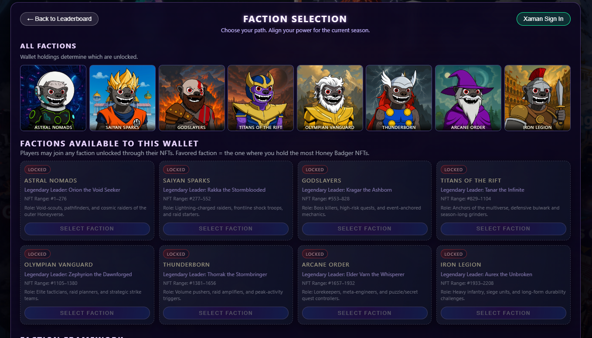
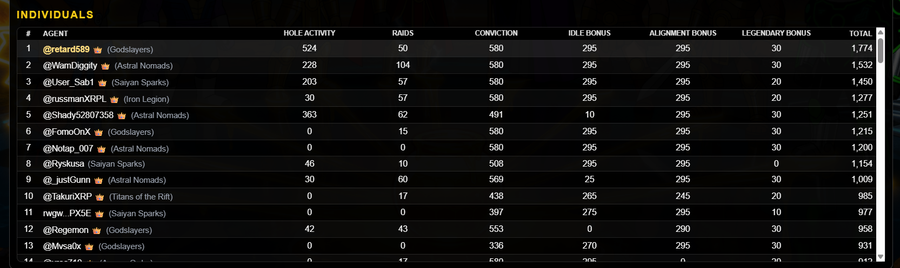

# 🎰 Gaming & Community Platforms

> Entertainment, gaming, and community engagement platforms on the XRP Ledger

---

## Faction Wars

  
  
  
  **NFT Community Engagement Platform**
  

### Overview
A gamified community engagement platform built around NFT ownership. Users join factions based on their NFT holdings, earning Faction Points (FP) through X/Twitter engagement, community raids, NFT ownership, and cross-platform activity. Features seasonal competitions, leaderboards, and rewards.

### Features
- ✅ Xaman wallet integration with NFT verification
- ✅ 8 unique factions based on NFT token ranges
- ✅ Multi-source point accumulation:
  - X/Twitter raid participation
  - NFT ownership (idle bonus)
  - Faction alignment bonus
  - Community engagement scoring
  - Cross-platform activity tracking
- ✅ Real-time faction & individual leaderboards
- ✅ Season-based competitions with countdown timers
- ✅ Global and faction-specific chat systems
- ✅ Admin dashboard with 2FA security
- ✅ Automated point distribution via Firebase Functions

### Screenshots

View Screenshots

*Faction and individual rankings*

*Choose your faction based on NFT ownership*

*Track points and engagement*

### Tech Stack
`JavaScript` `Firebase` `Cloud Functions` `xrpl.js` `Xaman SDK` `Firestore`

---

## Entertainment Platform

  
  
  
  **Interactive Entertainment Hub**
  

### Overview
A unique entertainment platform combining gaming elements with social features. Engage, compete, and earn.

### Features
- ✅ Interactive games
- ✅ Social features
- ✅ Reward system
- ✅ NFT integration
- ✅ Leaderboards
- ✅ Events calendar
- ✅ Community challenges

### Screenshots

View Screenshots

### Tech Stack
`React` `Node.js` `xrpl.js` `MongoDB`

---

  
  [← Back to Portfolio](../README.md)
  
  **Interested in our gaming platforms?** [Contact Us](https://x.com/GridXRPL)
  

