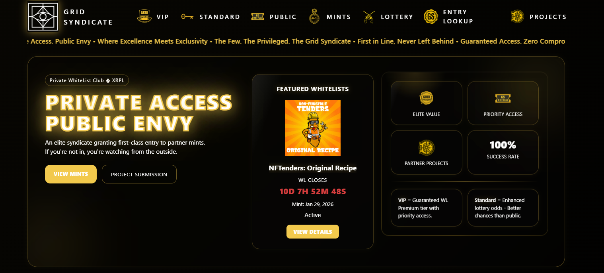
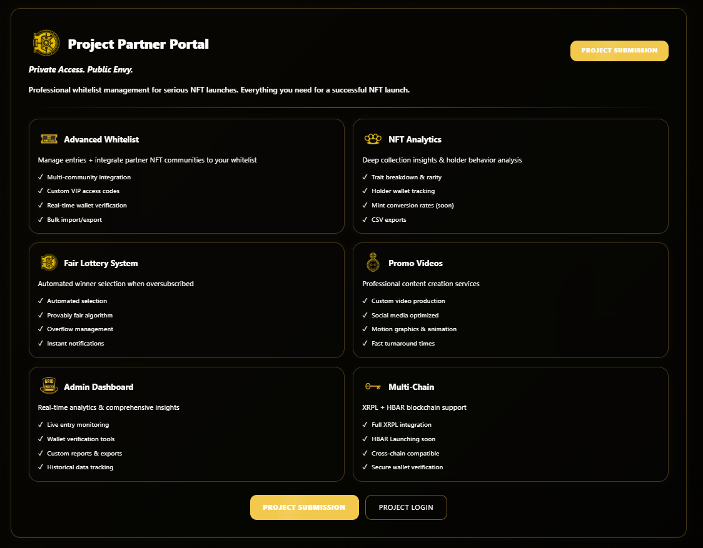
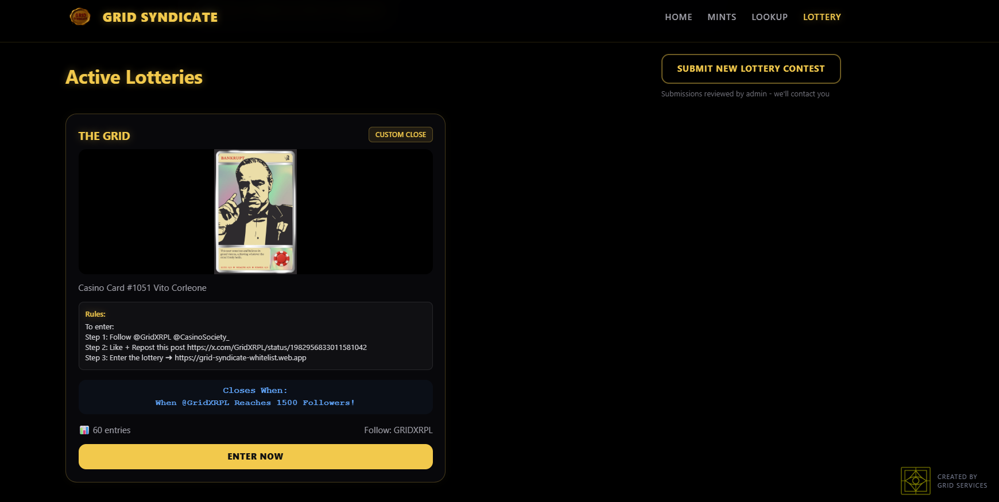
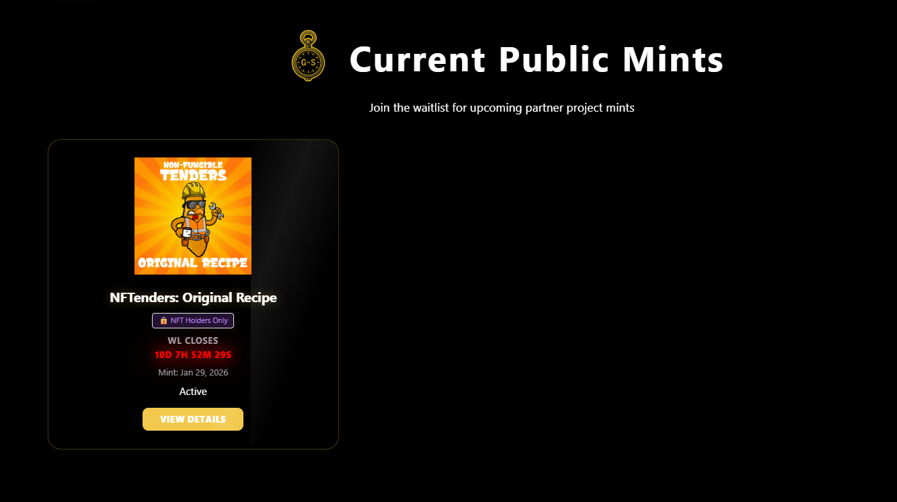

# 🖼️ NFT

> NFT solutions for the XRP Ledger

---

## GRID Syndicate

  
  
  
  **NFT Whitelist & Lottery Platform**
  

### Overview
Comprehensive NFT whitelist platform for GRID Syndicate featuring a public waitlist system, mint management, and admin dashboard. Enables community members to join waitlists for upcoming NFT mints with integrated lottery and winner selection functionality.

### Features
- ✅ Public waitlist registration system
- ✅ Mint-specific and general waitlist options
- ✅ Admin dashboard for entry management
- ✅ CSV export functionality
- ✅ Automated lottery/winner selection
- ✅ Firebase-powered backend
- ✅ Mobile-responsive design
- ✅ XRPL wallet integration

### Tech Stack
`JavaScript` `Firebase` `Firestore` `TailwindCSS` `XRPL`

### Screenshots

📸 View More Screenshots

*Waitlist registration interface*

*Admin dashboard*

*Platform features*

---

## NFT Marketplace

  
  
  
  **Full-Featured XRPL NFT Trading Platform**
  

### Overview
A comprehensive NFT marketplace built on the XRP Ledger. Buy, sell, and trade NFTs with low fees and fast transactions.

### Features

#### Trading
- ✅ Buy/Sell NFTs
- ✅ Auction system
- ✅ Make/Accept offers
- ✅ Bundle sales
- ✅ Instant sales

#### Discovery
- ✅ Collection browsing
- ✅ Advanced search & filters
- ✅ Trending collections
- ✅ Rarity rankings
- ✅ Price history

#### Creator Tools
- ✅ Mint NFTs
- ✅ Collection management
- ✅ Royalty settings
- ✅ Batch minting
- ✅ Reveal mechanics

#### User Features
- ✅ Portfolio tracking
- ✅ Watchlists
- ✅ Activity feed
- ✅ Notification system
- ✅ Analytics dashboard

### Screenshots

View Screenshots

### Home Page

### Collection View

### NFT Detail

### User Profile

### Minting Interface

### Tech Stack

| Layer | Technologies |
|-------|--------------|
| Frontend | React, Next.js, TailwindCSS |
| Backend | Node.js, Express, TypeScript |
| Database | MongoDB, Redis |
| Blockchain | XRPL, xrpl.js |
| Storage | IPFS, Cloudinary |
| Search | Elasticsearch |

### Stats

| Metric | Value |
|--------|-------|
| Collections Listed | 500+ |
| NFTs Traded | 50,000+ |
| Active Users | Growing |

---

  
  [← Back to Portfolio](../README.md)
  
  **Interested in our NFT marketplace?** [Contact Us](https://x.com/GridXRPL)
  

