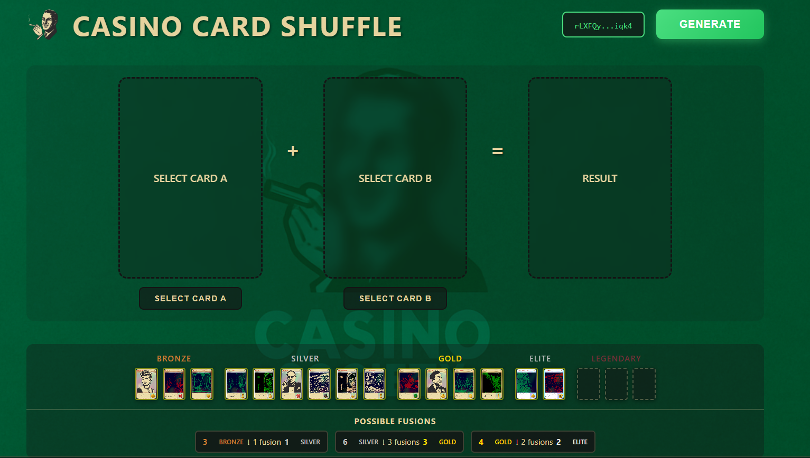
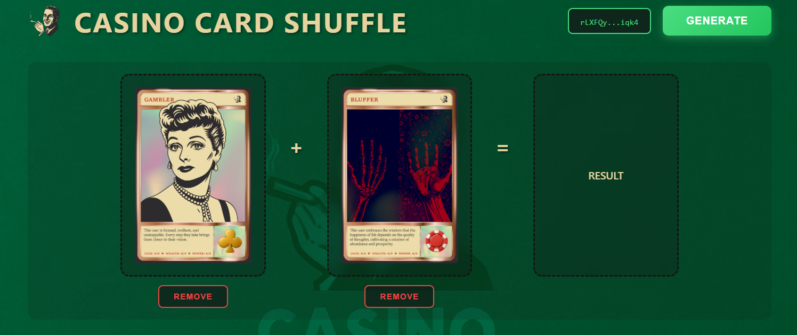

# 🖼️ NFT

> NFT solutions for the XRP Ledger

---

## GRID Syndicate

  
  
  
  **NFT Whitelist & Lottery Platform**
  

### Overview
Comprehensive NFT whitelist platform for GRID Syndicate featuring a public waitlist system, mint management, and admin dashboard. Enables community members to join waitlists for upcoming NFT mints with integrated lottery and winner selection functionality.

### Features
- ✅ Public waitlist registration system
- ✅ Mint-specific and general waitlist options
- ✅ Admin dashboard for entry management
- ✅ CSV export functionality
- ✅ Automated lottery/winner selection
- ✅ Firebase-powered backend
- ✅ Mobile-responsive design
- ✅ XRPL wallet integration

### Tech Stack
`JavaScript` `Firebase` `Firestore` `TailwindCSS` `XRPL`

### Screenshots

📸 View More Screenshots

*Waitlist registration interface*

*Admin dashboard*

*Platform features*

---

## NFT Card Fusion

  
  
  
  **NFT Card Fusion & Reminting System**
  

### Overview
Connect your wallet, select two NFT cards from your collection, and fuse them together to create a brand new unique card. The fused card is then reminted directly to the XRP Ledger with combined traits and attributes.

### Features
- ✅ Wallet connection via Xaman
- ✅ Browse and select owned NFT cards
- ✅ Two-card fusion system
- ✅ Trait combination algorithm
- ✅ On-chain reminting to XRPL
- ✅ Metadata generation
- ✅ Firebase-powered trait database
- ✅ Card rarity system (Bronze, Silver, Gold, Halo)

### Screenshots

View Screenshots

*Select two cards to fuse*

*View your newly created card*

### Tech Stack
`JavaScript` `Firebase` `xrpl.js` `Node.js` `Cloud Functions`

---

## NFT Marketplace

  
  
  
  **Dynamic NFT Traits Marketplace**
  

### Overview
A traits marketplace for existing NFT collections on the XRP Ledger. NFT holders can browse, purchase, and apply new traits to customize their existing NFTs. Buy traits, preview changes on your NFT with a live canvas, and commit updates directly to the ledger.

### Features

#### Shopping
- ✅ Browse traits by category (Head, Chest, Eyes, etc.)
- ✅ Add traits to cart
- ✅ Live canvas preview of traits on your NFT
- ✅ Checkout with XRPL payment

#### NFT Integration
- ✅ Connect wallet to view owned NFTs
- ✅ Select NFT to customize
- ✅ Real-time trait layering preview
- ✅ Commit changes to XRPL ledger

#### Trait Management
- ✅ Category-based trait organization
- ✅ Trait ownership tracking
- ✅ My Traits library
- ✅ IPFS-backed trait storage

### Screenshots

View Screenshots

*Browse and purchase traits*

*Preview traits on your NFT*

*Checkout and commit to ledger*

### Tech Stack

| Layer | Technologies |
|-------|--------------|
| Frontend | Next.js, React, TypeScript, TailwindCSS |
| Backend | Firebase Functions, TypeScript |
| Database | Firestore |
| Blockchain | XRPL, xrpl.js, Xaman |
| Storage | IPFS (Pinata), Firebase Storage |

---

  
  [← Back to Portfolio](../README.md)
  
  **Interested in our NFT marketplace?** [Contact Us](https://x.com/GridXRPL)
  

