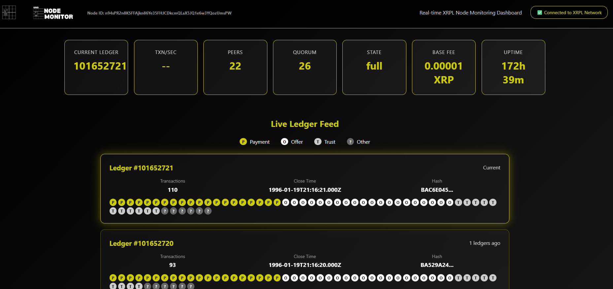
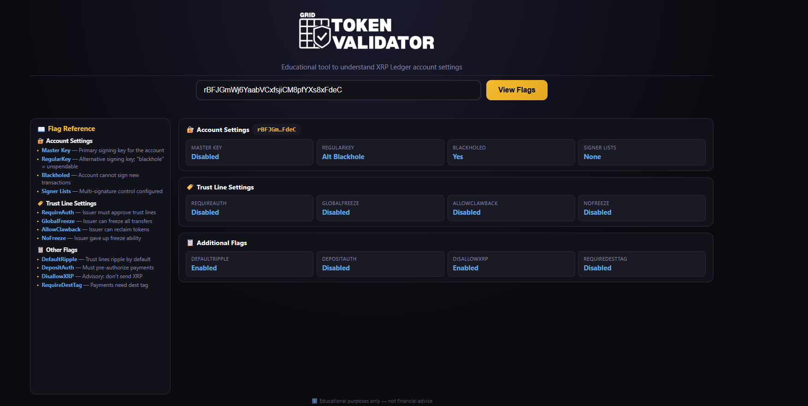

# 🛠️ Utilities

> Infrastructure and utility tools for the XRP Ledger

---

## GRID Node

  
  
  
  **Pruned Private XRPL Node**
  

### Overview
Custom pruned private XRPL node infrastructure for GRID Services. Provides reliable, fast access to the XRP Ledger with optimized storage and performance for production applications.

### Features
- ✅ Pruned ledger history
- ✅ Private node access
- ✅ WebSocket API
- ✅ REST API endpoints
- ✅ Optimized performance
- ✅ Dedicated GRID Services infrastructure
- ✅ Health monitoring
- ✅ Auto-restart capability

### Tech Stack
`rippled` `Docker` `Linux`

---

## Token Checker

  
  
  
  **XRPL Account Flag Viewer & Token Analyzer**
  

### Overview
Web-based tool for analyzing XRPL account flags and token configurations. Provides instant visualization of account settings, security flags, and token issuer properties to help users verify token safety and configuration.

### Features
- ✅ Real-time account flag analysis
- ✅ Visual flag status indicators
- ✅ Token issuer verification
- ✅ Security flag checking (RequireAuth, Disallow XRP, etc.)
- ✅ Trust line analysis
- ✅ Account settings overview
- ✅ Simple one-click account lookup
- ✅ Mobile-responsive interface

### Screenshots

View Screenshots

*Compact banner view of flag checker*

### Tech Stack
`JavaScript` `xrpl.js` `HTML/CSS` `Firebase Hosting`

---

## GRID Support System

  
  
  
  **Multi-Channel Support Ticketing Platform**
  

### Overview
Comprehensive support ticketing system built for GRID Services with multi-channel access (Web, Telegram, Discord). Features real-time ticket management, admin dashboard, and automated Discord alerts for seamless customer support operations.

### Features

#### User Portal
- ✅ Multi-channel ticket creation (Web, Telegram, Discord)
- ✅ Real-time ticket status updates
- ✅ Message threading & communication
- ✅ Ticket history tracking
- ✅ Email notifications

#### Admin Dashboard
- ✅ Unified ticket management across all channels
- ✅ Advanced filtering & search
- ✅ Inline status/priority editing
- ✅ Internal notes system
- ✅ Team assignment functionality
- ✅ Real-time statistics & metrics
- ✅ Discord webhook alerts
- ✅ Affiliate program management

#### Technical
- ✅ Firebase authentication & security
- ✅ Real-time Firestore sync
- ✅ Cloud Functions backend
- ✅ Role-based access control
- ✅ Mobile-responsive design

### Tech Stack
`React` `TypeScript` `Firebase` `Firestore` `Cloud Functions` `TailwindCSS` `Discord Webhooks`

---

  
  [← Back to Portfolio](../README.md)
  
  **Interested in our utility tools?** [Contact Us](https://x.com/GridXRPL)
  

