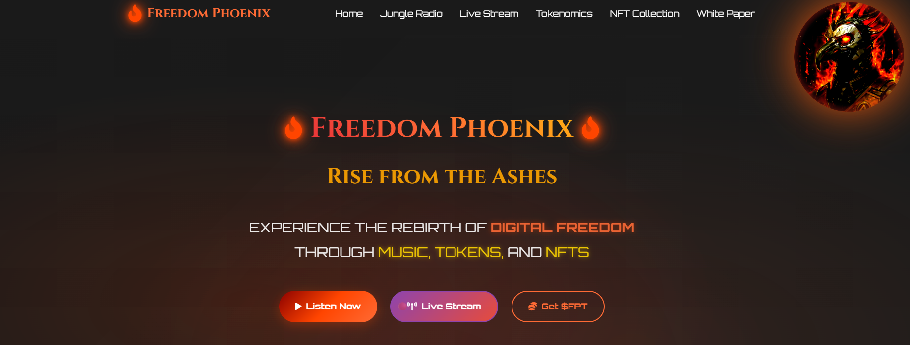
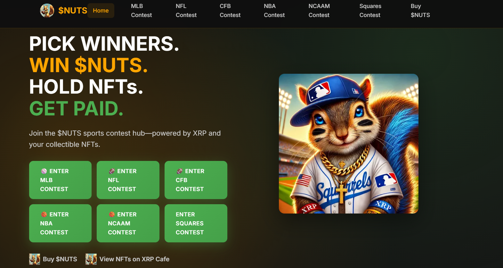

# 🌐 Websites & Platforms

> Web applications and community platforms

---

## The Badger Hole

  
  
  
  **Community Watchdog Platform**
  

### Overview
A community-driven platform for reporting and tracking bad actors in the XRPL ecosystem. Members can submit reports, provide evidence, and help protect the community from scammers, rugpulls, and fraudulent projects.

### Features
- ✅ Bad actor reporting system
- ✅ Evidence submission with attachments
- ✅ Community voting on reports
- ✅ Searchable rug library database
- ✅ Faction/reputation system
- ✅ Automated X/Twitter alerts
- ✅ Points and rewards system
- ✅ Admin moderation dashboard

### Screenshots

View Screenshots

### Tech Stack
`React` `TypeScript` `Firebase` `Cloud Functions` `TailwindCSS`

---

## Jester Token Website

  
  
  
  **Token Project Landing Page**
  

### Overview
Professional marketing website for the Jester token project. Features animated visuals, lore storytelling, tokenomics breakdown, roadmap, and community sections. Built with vanilla HTML/CSS/JS for fast loading and easy deployment.

### Features
- ✅ Animated hero sections with video/GIF backgrounds
- ✅ Tokenomics visualization
- ✅ Project roadmap timeline
- ✅ Lore & storytelling pages
- ✅ Community links integration
- ✅ Firebase hosting ready

### Screenshots

View Screenshots

### Tech Stack
`HTML` `CSS` `JavaScript` `Firebase Hosting`

---

## Jungle Radio

  
  
  
  **Live Streaming & Request Platform**
  

### Overview
A community radio platform with live streaming and song request functionality. Features real-time audio streaming, request queue management, and an interactive interface for listeners and DJs.

### Features
- ✅ Live audio streaming
- ✅ Song request system with queue
- ✅ Real-time request display
- ✅ DJ/host controls
- ✅ Listener interaction
- ✅ Mobile-responsive design

### Screenshots

View Screenshots

### Tech Stack
`HTML` `TailwindCSS` `Node.js` `Express` `SQLite`

---

## Nuts Websites

  
  
  
  **Sports Pick-Em Games Platform**
  

### Overview
A sports prediction platform for NFL and MLB games. Community members make weekly game picks, compete on leaderboards, and earn rewards. Features Xaman wallet integration for XRPL token payments and NFT holder verification.

### Features
- ✅ NFL & MLB game pick-em
- ✅ Weekly game schedules via ESPN API
- ✅ Real-time leaderboards
- ✅ Xaman wallet integration
- ✅ XRPL token payments
- ✅ NFT holder verification
- ✅ Admin game management
- ✅ Firebase backend

### Tech Stack
`React` `TypeScript` `Firebase` `Cloud Functions` `TailwindCSS` `xrpl.js`

---

## Community Hub

  
  
  
  **Community Engagement Platform**
  

### Overview
A dedicated space for community members to connect, share, and participate in ecosystem activities.

### Features
- ✅ Member directory
- ✅ Content sharing
- ✅ Achievement system
- ✅ Event coordination
- ✅ Resource library
- ✅ Notification system

### Screenshots

View Screenshots

### Tech Stack
`React` `Node.js` `MongoDB` `Socket.io`

---

## Web3 Application

  
  
  
  **Utility Web Application**
  

### Overview
A versatile web application providing various utilities and services for XRPL users and token holders.

### Features
- ✅ Wallet integration
- ✅ Token utilities
- ✅ User dashboard
- ✅ Analytics
- ✅ Notifications
- ✅ API access

### Screenshots

View Screenshots

### Tech Stack
`React` `TypeScript` `Node.js` `xrpl.js` `MongoDB`

---

## LUCHA Token Website

  
  
  
  **Token Marketing & Information Website**
  

### Overview
A modern marketing website built for the LUCHA token ecosystem. Features comprehensive tokenomics documentation, whitepaper, NFT collection showcases, and project information. Built with Next.js for optimal performance and SEO.

### Features
- ✅ Modern responsive design
- ✅ Tokenomics breakdown
- ✅ Whitepaper documentation
- ✅ NFT collection showcase
- ✅ Team & roadmap sections
- ✅ Social integration
- ✅ Animated UI components

### Tech Stack
`Next.js` `TypeScript` `TailwindCSS` `React`

---

  
  [← Back to Portfolio](../README.md)
  
  **Interested in our web platforms?** [Contact Us](https://x.com/GridXRPL)
  

