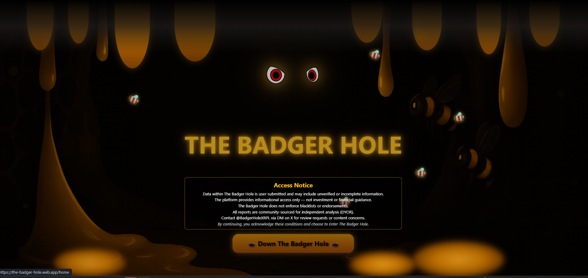
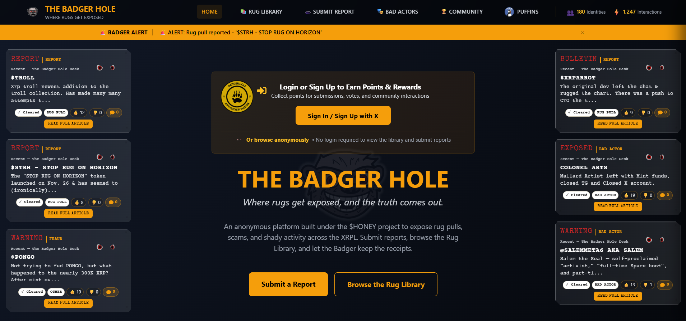
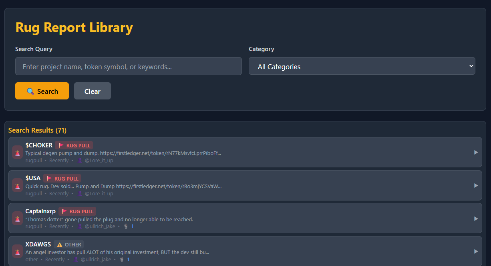
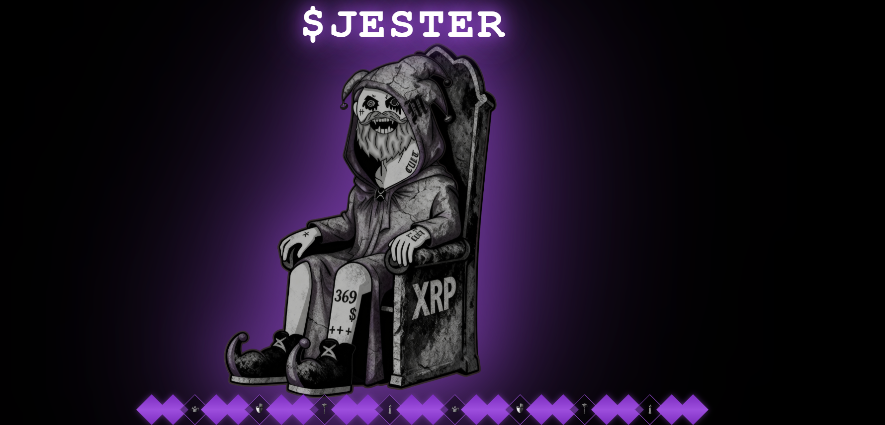
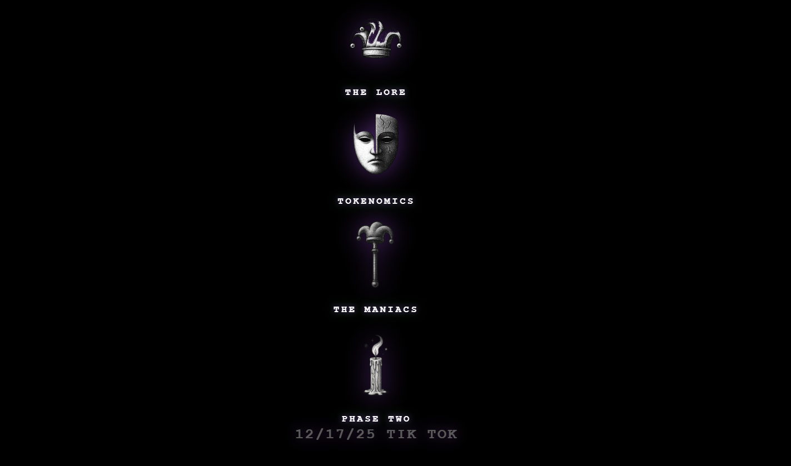
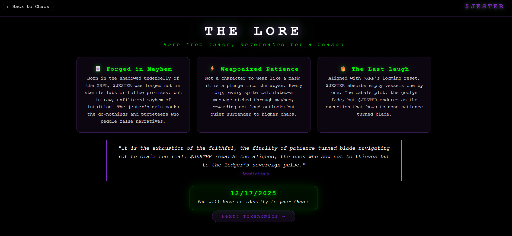
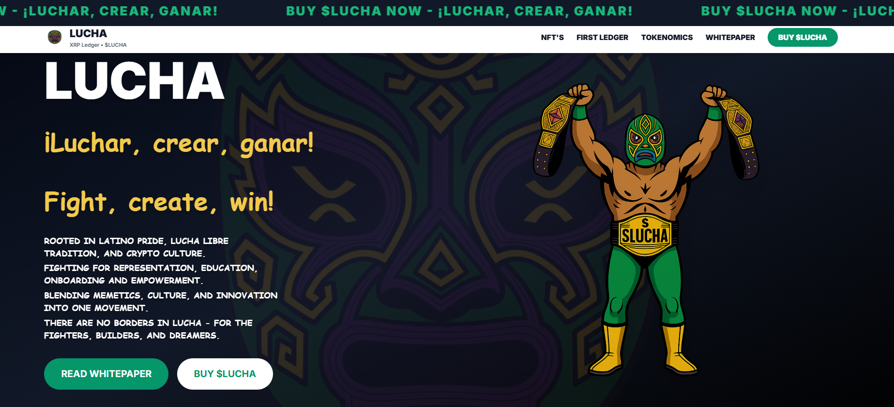

# 🌐 Websites & Platforms

> Web applications and community platforms

---

## The Badger Hole

  
  
  
  **Community Watchdog Platform**
  

### Overview
A community-driven platform for reporting and tracking bad actors in the XRPL ecosystem. Members can submit reports, provide evidence, and help protect the community from scammers, rugpulls, and fraudulent projects.

### Features
- ✅ Bad actor reporting system
- ✅ Evidence submission with attachments
- ✅ Community voting on reports
- ✅ Searchable rug library database
- ✅ Faction/reputation system
- ✅ Automated X/Twitter alerts
- ✅ Points and rewards system
- ✅ Admin moderation dashboard

### Screenshots

View Screenshots

### Tech Stack
`React` `TypeScript` `Firebase` `Cloud Functions` `TailwindCSS`

---

## Jester Token Website

  
  
  
  **Token Project Landing Page**
  

### Overview
Professional marketing website for the Jester token project. Features animated visuals, lore storytelling, tokenomics breakdown, roadmap, and community sections. Built with vanilla HTML/CSS/JS for fast loading and easy deployment.

### Features
- ✅ Animated hero sections with video/GIF backgrounds
- ✅ Tokenomics visualization
- ✅ Project roadmap timeline
- ✅ Lore & storytelling pages
- ✅ Community links integration
- ✅ Firebase hosting ready

### Screenshots

View Screenshots

### Tech Stack
`HTML` `CSS` `JavaScript` `Firebase Hosting`

---

## Streaming Platform

  
  
  
  **Community Media Platform**
  

### Overview
A streaming platform for crypto communities. Live shows, podcasts, and community radio.

### Features
- ✅ Live streaming
- ✅ Podcast archive
- ✅ Show schedule
- ✅ Live chat
- ✅ Request system
- ✅ Host profiles
- ✅ Community playlists

### Screenshots

View Screenshots

### Tech Stack
`React` `Node.js` `WebSocket` `Audio API` `MongoDB`

---

## Multi-Brand Platform

  
  
  
  **Multi-Tenant Web Platform**
  

### Overview
A collection of websites for token ecosystems. Multiple interconnected web properties under one platform.

### Features
- ✅ Multi-tenant architecture
- ✅ Shared authentication
- ✅ Consistent branding
- ✅ Analytics dashboard
- ✅ CMS integration
- ✅ SEO optimization

### Screenshots

View Screenshots

### Tech Stack
`React` `Next.js` `Node.js` `PostgreSQL` `Vercel`

---

## Community Hub

  
  
  
  **Community Engagement Platform**
  

### Overview
A dedicated space for community members to connect, share, and participate in ecosystem activities.

### Features
- ✅ Member directory
- ✅ Content sharing
- ✅ Achievement system
- ✅ Event coordination
- ✅ Resource library
- ✅ Notification system

### Screenshots

View Screenshots

### Tech Stack
`React` `Node.js` `MongoDB` `Socket.io`

---

## Web3 Application

  
  
  
  **Utility Web Application**
  

### Overview
A versatile web application providing various utilities and services for XRPL users and token holders.

### Features
- ✅ Wallet integration
- ✅ Token utilities
- ✅ User dashboard
- ✅ Analytics
- ✅ Notifications
- ✅ API access

### Screenshots

View Screenshots

### Tech Stack
`React` `TypeScript` `Node.js` `xrpl.js` `MongoDB`

---

## LUCHA Token Website

  
  
  
  **Token Marketing & Information Website**
  

### Overview
A modern marketing website built for the LUCHA token ecosystem. Features comprehensive tokenomics documentation, whitepaper, NFT collection showcases, and project information. Built with Next.js for optimal performance and SEO.

### Features
- ✅ Modern responsive design
- ✅ Tokenomics breakdown
- ✅ Whitepaper documentation
- ✅ NFT collection showcase
- ✅ Team & roadmap sections
- ✅ Social integration
- ✅ Animated UI components

### Tech Stack
`Next.js` `TypeScript` `TailwindCSS` `React`

---

  
  [← Back to Portfolio](../README.md)
  
  **Interested in our web platforms?** [Contact Us](https://x.com/GridXRPL)
  

